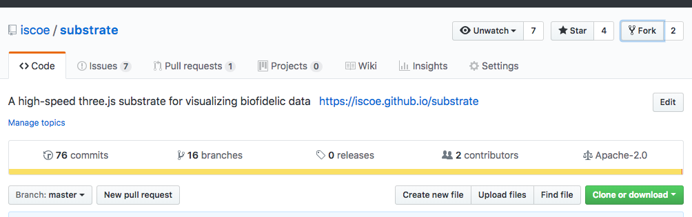

# Contributing

## Setting up your environment

## Versions

You will need to have node installed on your computer, as well as one of `yarn` or `npm`. Substrate developers prefer `yarn`.

You need at least:

- `yarn` v1.9.4
- `node` v10.9.0

## Repositories

In order to develop substrate, you must clone the `substrate` repository.

### Core Contributors

```shell
git clone https://github.com/iscoe/substrate
```

### Non-core contributors

We recommend forking the repository by clicking on the "Fork" button on the substrate GitHub page:




### Using `substrate-demos`

Though it is not required, we suggest _also_ cloning `substrate-demos`, which is a repo that contains simple demos for the substrate library. These demos may help you debug your changes to the substrate repository.

```shell
git clone https://github.com/iscoe/substrate-demos
```

## Submitting changes

Substrate uses a feature-branch style of [trunk-based development](https://trunkbaseddevelopment.com/). Please make your branch names meaningful, and **when you submit a pull request, please make sure the edits you've made are atomic**. In other words, if you're submitting a new feature, please do not include an unrelated bug fix in the same PR.

Do not include `console.log` statements in your pull request or it will be declined: Use `console.[info|warn|error]` when debug outputs are explicitly needed (hint: this is rare).

Tests are difficult to write for 3D and canvas visualizations, but if your code is a standalone utility, we encourage you to include tests for your code in order to hasten the code-review process.

## Building substrate

There are two build processes for substrate:

- Module build
- Minified static build

The module build makes substrate importable in other node projects (such as `substrate-demos`).

Conversely, the minified static build, which _requires the module build to take place first_, produces a single file, `substrate.min.js`, which can be imported into a static HTML file with a `<script>` tag.

When you submit a pull request, please run both the module as well as the minified builds.

### Building the module build

```
yarn run rebuild
```

### Building the minified file as well as the module

```
yarn run minify
```

While building the minified file is adequate to rebuild both the module as well as the min.js file, it takes substantially longer (since minification is complicated on a large codebase) and so **when you are developing substrate and debugging changes, it makes more sense to just rebuild the module rather than the full minification.**


## Using the `substrate-demos` repo to debug edits to `substrate`

It may help to use a minimal working example to debug your changes as you edit substrate. If that is the case, you may choose to use [`substrate-demos`](https://github.com/iscoe/substrate-demos), which has many already-built and known-to-work code examples in it.

### Installing your edited version of substrate

You can easily point a node project to your under-development substrate codebase by ensuring it is not already pointing to an `apl-substrate` module, and then pointing it instead at your copy:

```shell
npm uninstall apl-substrate && npm install -S path/to/your/substrate/
```

Now, when you rebuild the `apl-substrate` module (see [Building Substrate](#building-substrate)) your node project will automatically update with the new features.
